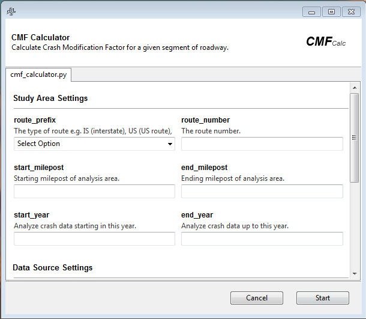

# CMF Calculator
CMF Calculator is a desktop application used to perform crash modification factor analysis.

# Inputs
In order to run the analyis an input Excel file that defines CMF values that apply to the particular road segment is required.

The file can contain any number columns but the following fields are **REQUIRED**.

| Severity | Crash_Type | Start_MP | End_MP | CMF | Direction | Time |
| --- | --- | --- | --- | --- | --- | --- |
| data | data | data | data | data | data | data |

Note that these column names and values **ARE case sensitive**!

| Column | Data Type | Explanation | Example |
| --- | --- | --- | --- |
| Severity | Text | Defines the severity of the crash | Fatal Crash |
| Crash_Type | Text | Defines the collision type | Same Direction Sideswipe |
| Start_MP | Float | Defines the starting mile post | 1.9 |
| End_MP | Float | Defines the ending (inclusive) mile post | 3.28 |
| CMF | Float | The CMF value | 0.79 |
| Direction | Text | A letter representing one of the cardinal directions | N, S, E, or W|
| Time | Text | A categorical 'time' value | AM or PM |

Some values are constrained to a limited set of options.

Severity must be one of:
* `All`
* `Fatal Crash`
* `Inury Crash`
* `Property Damage Crash`

Crash Type must be one of:
* `All`
* `Angle Meets Left Turn`
* `Angle Meets Left Turn Head On`
* `Angle Meets Right Turn`
* `Head On`
* `Head On Left Turn`
* `Not Applicable`
* `Opposite Direction Both Left Turn`
* `Opposite Direction Sideswipe`
* `Other`
* `Same Direction Both Left Turn`
* `Same Direction Left Turn`
* `Same Direction Rear End`
* `Same Direction Rear End Left Turn`
* `Same Direction Rear End Right Turn`
* `Same Direction Right Turn`
* `Same Direction Sideswipe`
* `Same Movement Angle`
* `Single Vehicle`
* `Unknown`

Direction must be one of:
* `All`
* `N`
* `S`
* `E`
* `W`

Time must be one of:
* `All`
* `AM`
* `PM`

# Outputs
The output of this program is a single Excel file. The output file will be saved in the same directory as the input Excel file that defines the CMF values and study area. The output file name will be structured as follows:
    
`<route prefix>-<route number> [<start milepost>-<end milepost>] (<start year> - <end year>) CMF Analysis.xlsx`

Such that a study on MD 197 between mile posts 1.9 to 3.28 that looks at all crashes that occured from 2015 to 2018 would be named `MD-197 [1.9-3.28] (2015-2018) CMF Analysis.xlsx`

The output file will always contain a worksheet named `Results`.

## Standard output
The standard output on the `Results` worksheet will contain tables that summarize the analysis results. An example of the reported measures are as follows:

|| Total | Fatal | Injury | Property Damage | Specific Collitions Type * |
|---|---|---|---|---|---|
| NUMBER OF ACCIDENTS | 157 | 20 | 30 | 88 | 4
| CRASH MODIFICATION FACTOR (CMF) | 0.8 | 0.77 | 0.82 | 0.77 | 0.76
| CRASH REDUCTION FACTOR (CRF) | 20.0 | 23.0 | 18.0 | 23.0 | 24.0 |
| EXPECTED CHANGE IN ACCIDENTS (%) | 0.2 | 0.23 | 0.18 | 0.23 | 0.24 |
| ANNUAL NET CRASH REDUCTION | 9.01 | 4.32 | 6.56 | 2.56 | 5.9 |

\* multiple columns; one for each collision type

## Optional outputs
Optionally, the user may choose to include additional outputs for completeness or to validate the analyis results. The optional outputs include:
* Input CMFS: output a copy of the input CMF data in a worksheet named `Input CMFs`.
* Raw Crash Data: output a copy of the data returned from the crash report request in a worksheet named `Crash Data`.
* Crash Summary: output a summary of the crash data broken down by year in a worksheet named `Crash Summary`.